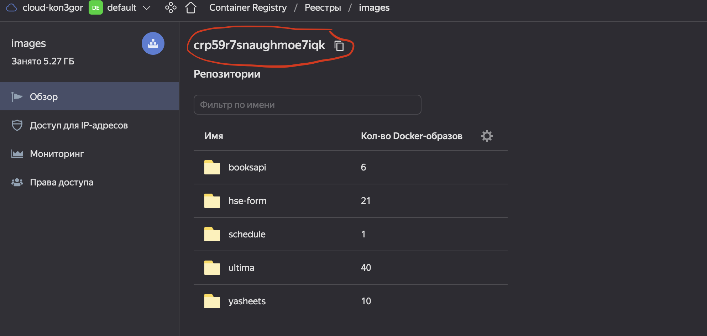

# Как использовать докер
Почитать про то, что такое докер и зачем он нужен можно [тут](https://www.docker.com/).
Скачать докер можно [тут](https://docs.docker.com/get-docker/)
Хороший курс по докеру с короткими и ёмкими видео [тут](https://youtube.com/playlist?list=PLD5U-C5KK50XMCBkY0U-NLzglcRHzOwAg)

### Основные нужные команды
- [build](https://docs.docker.com/engine/reference/commandline/build/) - для создания образа
- [login](https://docs.docker.com/engine/reference/commandline/login/) - для авторизации в Яндекс облаке
- [push](https://docs.docker.com/engine/reference/commandline/push/) - для отправки образа в Яндекс облако

### Пример используемого мной скрипта
```bash
OAUTH_TOKEN='<OAuth token>'
DOCKER_IMAGE_NAME='cr.yandex/<id реестра>/<Название>'
docker login --username oauth --password "$OAUTH_TOKEN"  cr.yandex
docker build -t "$DOCKER_IMAGE_NAME" --platform=linux/amd64 .
docker push $DOCKER_IMAGE_NAME
```
Этот скрипт по сути делает все, что нужно. Сначала логинится в реестр контейнеров Яндекс облака, потом билдит образ для нужной платформы и в конце пушит полученный образ в реестр Яндекс облака для дальнейшего использования. В качестве название образа подойдет любое сочетание латинских букв.

**Полезные ссылки:**
 - [Как получить OAuth token для авторизации через CLI](https://cloud.yandex.ru/docs/container-registry/operations/authentication#user-oauth)
 - Где найти ID реестра
   
