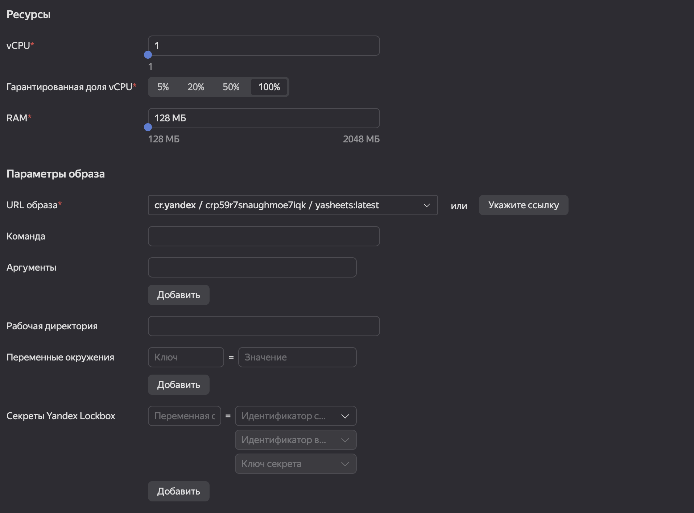

# Как использовать Яндекс Облако
О Яндекс Облаке можно почитать [тут](https://cloud.yandex.ru/). Зарегистрироваться и ознакомиться с тарифами можно там же.

## Развертывание сервиса
Чтобы развернуть сервис YaForms нужно использовать несколько ресурсов:
- [Container registry](https://cloud.yandex.ru/docs/container-registry/)
- [Serverless containers](https://cloud.yandex.ru/docs/serverless-containers/)

Их описание и инсрукции по созданию данных ресурсов есть в документации к сервисам, можно просто следовать им.

### Как соединить все вместе
После успешного создания реестра контейнеров и загрузки в него образа, можно перейти к развертыванию сервиса через Serverless Containers. Сам процесс создания контейнера хорошо описан в [документации](https://cloud.yandex.ru/docs/serverless-containers/quickstart#create-container). После создания контейна нужно создать его ревизию (по сути версия). Для этого в открывшемся окне кликните на поле URL образа и выберете загруженный образ. Тег выберете latest. Все остальные настройки оставьте как есть. Также нужно будет создать сервисный аккаунт. Просто кликните на "Создать новый" рядом с полем для выбора сервисного аккаунта и укажите имя, после чего нажмите "Создать"

В дальнейшем для создания новой ревизии (если меняете образ и заново его загружаете) нужно будет просто зайти в редактор контейнера и нажать "Создать ревизию".

Далее вас перекинет на окно Обзор, в котором нужно будет переключить тогл "Публичный контейнер", чтобы к вашему контейнру можно было обратиться извне. Также в этом окне можно найти url вашего контейнера, он пригодится при создании интеграции для формы.

### Как проверить что все работает
Пожете перейти по адресу <url контейнера>/ping. В ответ вы должны получить pong, это будет означать, что все работает как надо и можно переходить к настройке интеграции.
